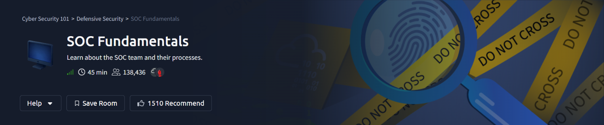
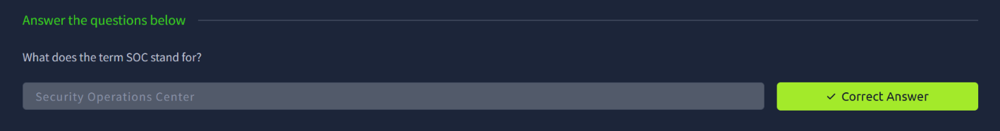
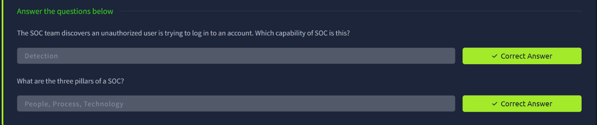
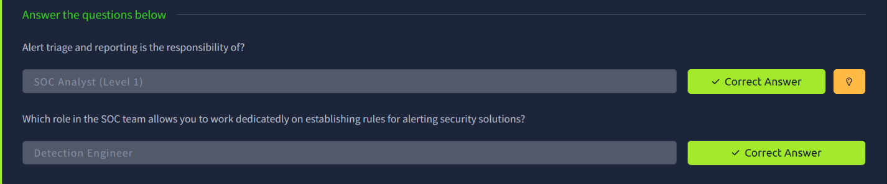
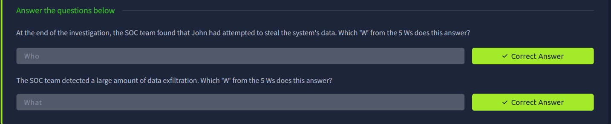
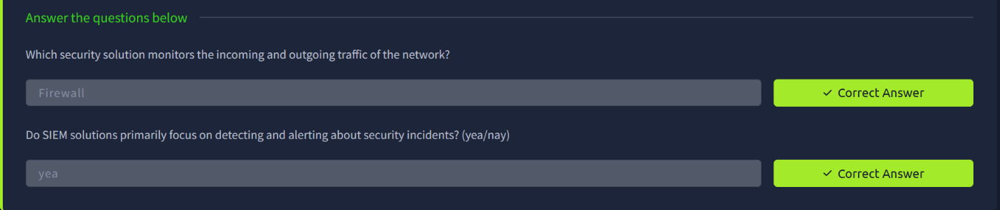
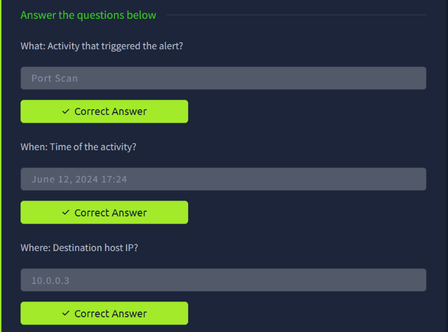
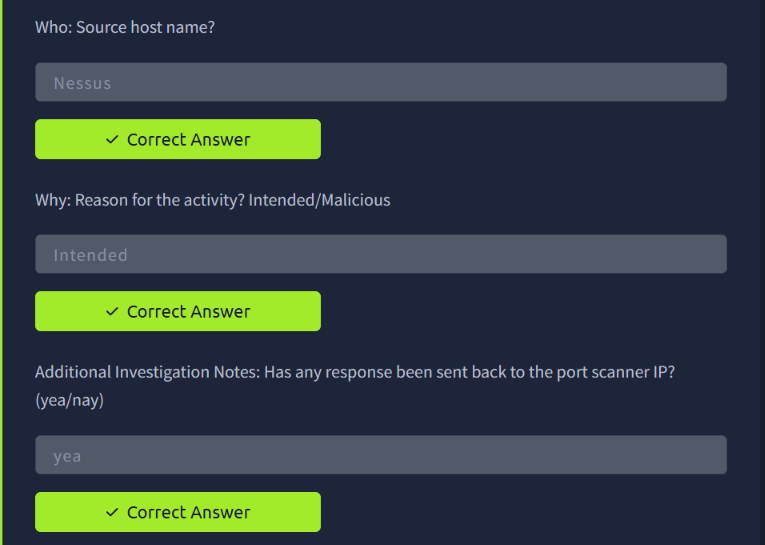
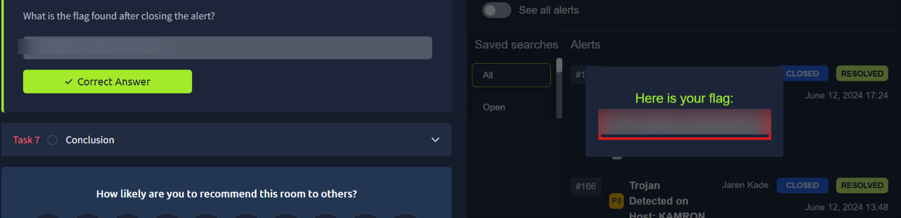

# TryHackMe — SOC Fundamentals

> **Track:** Cyber Security 101 → Defensive Security
> **Difficulty:** Easy · **Time:** ~45 min
> **Focus:** What a SOC is, its capabilities and roles, the 5 Ws of alert investigation, and a hands-on alert triage walkthrough

Offensive security gets the spotlight, but every attack eventually runs into defenders. This room covers the other side of the table: what a **Security Operations Center (SOC)** actually is, how it's structured, and the investigative framework analysts use to triage a real alert — finishing with a hands-on alert closed out in a SIEM-style interface.

---

## Table of Contents
1. [What Is a SOC?](#1-what-is-a-soc)
2. [SOC Capabilities and the Three Pillars](#2-soc-capabilities-and-the-three-pillars)
3. [SOC Roles: Analyst Tiers and Detection Engineering](#3-soc-roles-analyst-tiers-and-detection-engineering)
4. [The 5 Ws of Investigation](#4-the-5-ws-of-investigation)
5. [Supporting Security Solutions: Firewall and SIEM](#5-supporting-security-solutions-firewall-and-siem)
6. [Hands-On: Triaging a Port Scan Alert](#6-hands-on-triaging-a-port-scan-alert)
7. [Key Takeaways](#7-key-takeaways)

---

## 1. What Is a SOC?

**SOC** stands for **Security Operations Center** — the team responsible for continuously monitoring, detecting, and responding to security threats across an organization.

---

## 2. SOC Capabilities and the Three Pillars

A SOC's core capabilities map onto the stages of handling a threat. When the SOC team discovers an unauthorized login attempt, that's the **Detection** capability in action — spotting the suspicious activity in the first place, distinct from investigating it or responding to it.

Underpinning every SOC capability are its **three pillars**: **People, Process, and Technology**. All three have to work together — skilled analysts (People) following defined playbooks (Process) using the right tooling (Technology) is what makes a SOC function at all.

---

## 3. SOC Roles: Analyst Tiers and Detection Engineering

SOC teams are tiered by responsibility:

- **Alert triage and reporting** is the responsibility of the **SOC Analyst (Level 1)** — the frontline role that reviews incoming alerts, determines severity, and escalates when needed.
- The **Detection Engineer** role is dedicated to establishing the rules that drive alerting across security solutions — writing and tuning the detection logic other analysts rely on, rather than triaging alerts day-to-day.

---

## 4. The 5 Ws of Investigation

Every SOC investigation is structured around the classic journalistic framework — **Who, What, When, Where, Why** — applied to security events:

- Finding that **John** attempted to steal data answers **Who**.
- Detecting **large-scale data exfiltration** answers **What**.

This structure isn't just academic — it's the backbone of how the hands-on alert later in the room gets documented.

---

## 5. Supporting Security Solutions: Firewall and SIEM

- A **Firewall** is the security solution that monitors the incoming and outgoing traffic of a network, enforcing rules about what's allowed to pass.
- **SIEM** (Security Information and Event Management) solutions **do** primarily focus on detecting and alerting about security incidents — aggregating logs from across the environment so analysts have one place to spot and investigate activity.

---

## 6. Hands-On: Triaging a Port Scan Alert

The practical task puts the 5 Ws framework to work against a real alert in a SIEM-style dashboard. The alert: a **Port Scan**.

**What, When, Where:**
- **What** (activity that triggered the alert): **Port Scan**
- **When** (time of the activity): **June 12, 2024, 17:24**
- **Where** (destination host IP): **10.0.0.3**

**Who, Why, and investigation notes:**
- **Who** (source host name): **Nessus** — a vulnerability scanner, which strongly suggests this traffic is legitimate internal scanning rather than an attacker.
- **Why** (reason for the activity): **Intended** — confirming the Nessus scan was authorized, not malicious.
- **Additional investigation note**: checking whether any response was sent back to the port scanner IP — confirmed **yes**, consistent with a normal scan interaction rather than a blocked/dropped attempt.

**Closing the alert:**
With the source identified as an authorized vulnerability scanner and the activity confirmed as intended, the alert is closed as **resolved**. Closing it out reveals the room's flag.

> Flag redacted — the technique (apply the 5 Ws → confirm intent → close as resolved) is what matters.

---

## 7. Key Takeaways

- **People, Process, Technology** is the lens for evaluating any SOC's maturity — a gap in any one of the three weakens the whole operation.
- **Tiered roles exist for a reason**: Level 1 analysts triage volume; Detection Engineers invest in the rules that make that triage effective in the first place.
- **The 5 Ws turn a raw alert into a documented decision.** Every investigation in this room followed the same shape: What happened, When, Where, Who caused it, and Why — answering all five is what separates a guess from a defensible close-out.
- **Context changes everything.** A port scan from `Nessus` with a confirmed "intended" reason is routine; the identical alert from an unrecognized host would demand a completely different response.
- Closing an alert isn't the end of the process — it's a documented conclusion that another analyst (or an auditor) could review and trust.

---

*Room completed on 6 October 2026 as part of the Cyber Security 101 path.*
